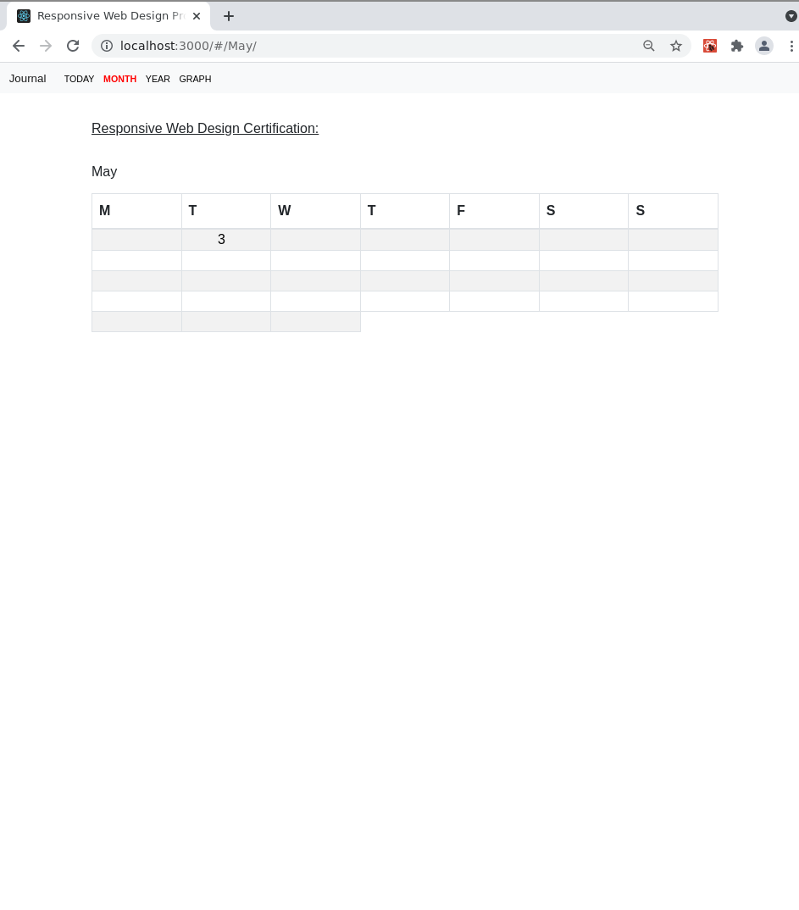

# Responsive Web Design Certification Journal
> A simple personal productivity app to track time spent on each project

> 🚧 Work in progress 🚧

This project was bootstrapped with
[Create React App](https://github.com/facebook/create-react-app).

# Important

- This project uses [localStorage](https://developer.mozilla.org/en-US/docs/Web/API/Window/localStorage).

# About the projects

 The projects are part of [freeCodeCamp's curriculum](https://www.freecodecamp.org/learn/responsive-web-design/responsive-web-design-projects/).

From Wikipedia:

> [freeCodeCamp](https://en.wikipedia.org/wiki/FreeCodeCamp)  is a non-profit organization that consists of an interactive learning web platform, an online community forum, chat rooms, online publications and local organizations that intend to make learning web development accessible to anyone.

# Dependencies

- react
- react-bootstrap
- bootstrap
- react-chartjs-2
- chart.js
- react-router-dom
- uuid
- gh-pages

# Getting started 

## First screen

## Select a project 

## Set Start and End field (hh:mm):

## Click hamburger/menu

## Click GRAPH 

## GRAPH 

## Click MONTH 

## MONTH 

## MONTH click  date

## YEAR click date 

## Date/day 

## YEAR Click  TODAY 

## TODAY 

# Live Demo

[DEMO](https://diegoperezm.github.io/responsive-web-design-certification-journal/)
